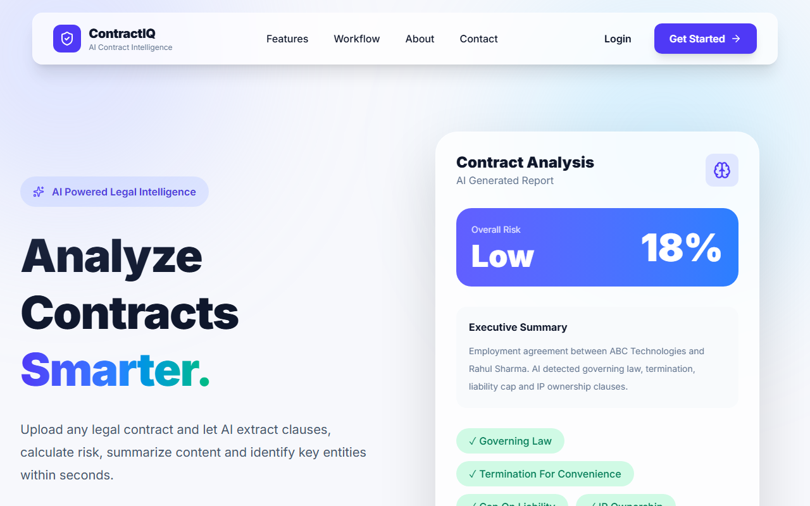
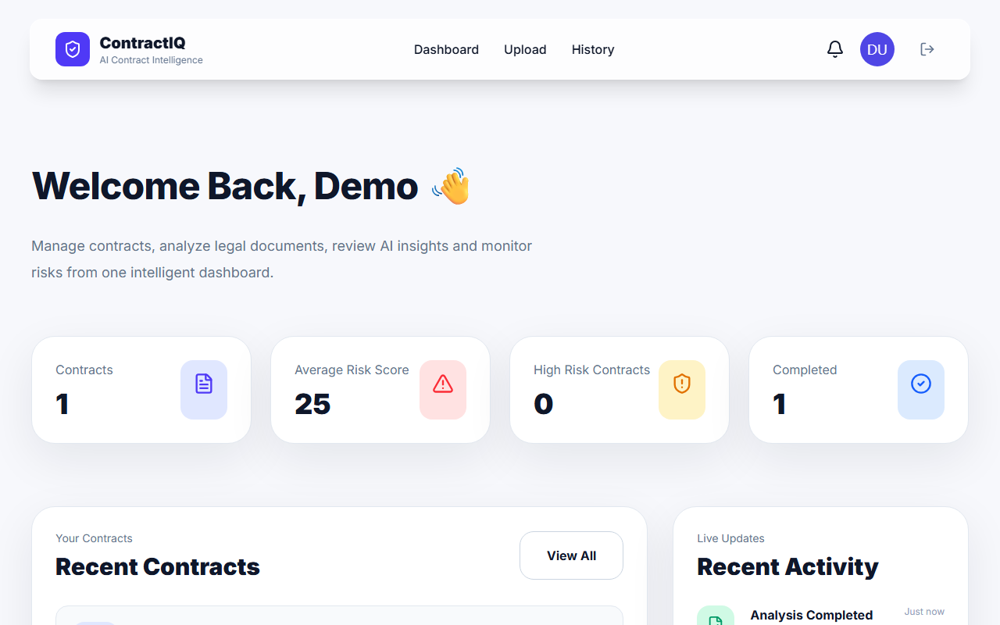
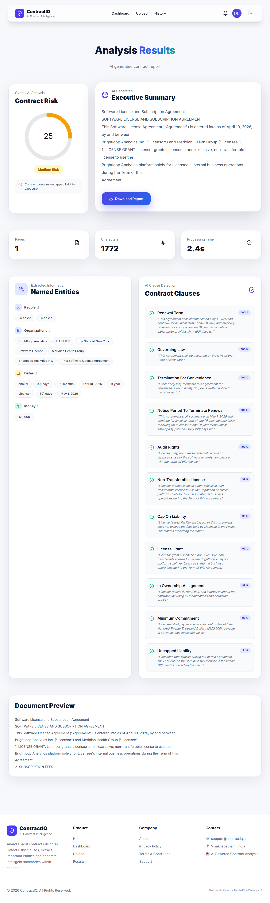

# ContractIQ

AI-powered contract analysis platform. Upload a PDF contract and get back
named entities, detected clauses, and a risk assessment — backed by a
clause classifier trained on a real legal dataset, not keyword matching.

## What it does

1. **Upload** a PDF contract through the web app.
2. A **Celery worker** picks up the file, extracts its text, and runs it
   through the analysis pipeline:
   - **Entity extraction** — people, organizations, dates, and money amounts
     (spaCy NER).
   - **Clause detection** — a multi-label classifier trained on
     [CUAD](https://www.atticusprojectai.org/cuad) (510 real contracts)
     identifies 19 clause categories (Governing Law, Termination For
     Convenience, Cap On Liability, IP Ownership Assignment, etc.), each
     with a confidence score and the matched excerpt.
   - **Risk scoring** — a transparent rule engine flags missing protective
     clauses and red-flag clauses (e.g. uncapped liability) based on what
     the classifier found.
3. The result is **persisted per user** and shows up in a real dashboard
   and history — not mock data.

## Screenshots

| Landing | Dashboard | Analysis Result |
|---|---|---|
|  |  |  |

## Tech stack

**Backend** — FastAPI, SQLAlchemy (SQLite), Celery + Redis, JWT auth
(PyJWT + bcrypt), spaCy, sentence-transformers, scikit-learn, pdfplumber

**Frontend** — React 19, Vite, Tailwind CSS 4, Framer Motion, React Router

**Infra** — Docker Compose (Redis + API + Celery worker)

See [docs/ARCHITECTURE.md](docs/ARCHITECTURE.md) for how these pieces fit
together, and [docs/MODEL_CARD.md](docs/MODEL_CARD.md) for the clause
classifier's training data, methodology, and known limitations.

## Features

- Real accounts (JWT sessions, bcrypt-hashed passwords), not a demo login
- Protected routes, redirect-back-after-login
- Async PDF processing via Celery so uploads don't block the API
- Contract history per user, with real dashboard stats (not hardcoded numbers)
- View any past analysis result again from Dashboard/History
- Graceful fallback to keyword matching if the trained model isn't present

## Getting started

The fastest path is Docker Compose — see
[docs/SETUP.md](docs/SETUP.md) for the full setup guide (including
native/non-Docker instructions and how to train the clause classifier).

```bash
cp .env.example .env   # fill in JWT_SECRET_KEY, PINECONE_API_KEY (optional)
docker compose up -d --build
cd frontend && npm install && npm run dev
```

Then open http://localhost:5173.

## Research notebooks

Before landing on the production approach, `notebooks/` documents earlier
hands-on experimentation on the same CUAD dataset:

- **`bert-training.ipynb`** — fine-tuning BERT-family transformers
  (`AutoModelForSequenceClassification`, `AutoModelForQuestionAnswering`)
  directly on CUAD via HuggingFace `transformers`/`datasets`, including an
  extractive-QA approach matching the original CUAD paper's methodology.
- **`semantic-search-pipeline.ipynb`** — embedding CUAD clauses with
  `sentence-transformers` and prototyping similarity search over them —
  the direct precursor to the embedding approach the production clause
  classifier (`training/train_clause_model.py`) is built on.

## Project structure

```
api/            FastAPI routes (auth, contracts, upload/task status)
src/            Core backend: db models, auth, Celery tasks, NLP pipeline
src/nlp/        Entity extraction, clause detection, risk scoring
training/       Script that trains the clause classifier on CUAD
frontend/       React app
docs/           Architecture, model card, setup guide
```

## Documentation

- [docs/ARCHITECTURE.md](docs/ARCHITECTURE.md) — system design and request flow
- [docs/MODEL_CARD.md](docs/MODEL_CARD.md) — clause classifier training data, metrics, limitations
- [docs/SETUP.md](docs/SETUP.md) — local development and deployment guide
