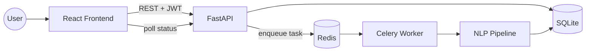

# Architecture

## Overview



## Request flow: uploading a contract

1. **Upload** — `POST /upload` (auth required). The API generates a task ID,
   creates a `Contract` row in SQLite with `status=PROCESSING` **before**
   enqueueing the Celery task (see below for why), then calls
   `process_pdf.apply_async(task_id=...)`.
2. **Processing** — A Celery worker (separate process, connected to the
   same Redis broker) picks up the task, extracts text from the PDF with
   `pdfplumber`, and runs the NLP pipeline.
3. **Persistence** — On success or failure, the worker writes the result
   (or error) back to the same `Contract` row via a direct DB write —
   independent of Celery's own result backend, so results survive past
   Celery's 1-hour result expiry.
4. **Polling** — The frontend polls `GET /task/{id}` for live progress,
   then navigates to the result page once the state is `SUCCESS`.
5. **History** — `GET /contracts` and `GET /contracts/{id}` let the
   frontend show real dashboard stats and let a user revisit any past
   analysis, scoped to their own account.

### Why the Contract row is created before enqueueing

Originally the task was enqueued first and the DB row created after. In a
fast/eager test run, the worker sometimes started (and tried to look up
its own row) before the row existed. Generating the task ID up front and
committing the row first closes that race entirely.

## NLP pipeline (`src/nlp/`)

```
extracted_text
    ├── entity_extractor.py  → spaCy NER (people, orgs, dates, money)
    ├── clause_detector.py   → trained classifier (see MODEL_CARD.md),
    │                          falls back to keyword matching if the
    │                          model artifacts aren't present
    └── risk_analyzer.py     → rule engine over the detected clauses:
                                penalizes missing protective clauses
                                (Governing Law, Termination, Liability
                                Cap, IP Ownership) and flags clauses that
                                are risky by their presence (Uncapped
                                Liability)
```

`contract_analyzer.py` composes these three into the single result object
returned by the API and stored on the `Contract` row.

## Auth

JWT (HS256), 7-day expiry, bcrypt-hashed passwords. `get_current_user` is
a FastAPI dependency used on every protected route (`/upload`,
`/task/{id}`, `/contracts*`). The frontend attaches the token via an
axios request interceptor and clears it automatically on a 401 response.

## Why Celery/Redis instead of just doing analysis in the request

PDF text extraction + NER + embedding-based clause classification takes
several seconds to over a minute depending on document length. Running
that synchronously in the request would block the API worker and time
out on longer documents; Celery lets `/upload` return immediately while
processing happens in the background, with the frontend polling for
progress.

## Directory layout

| Path | Purpose |
|---|---|
| `api/` | FastAPI route handlers only — no business logic |
| `src/` | Auth, DB models/schemas, Celery task, config |
| `src/nlp/` | The actual analysis pipeline |
| `training/` | Offline script that trains the clause classifier |
| `frontend/` | React app (Vite) |
